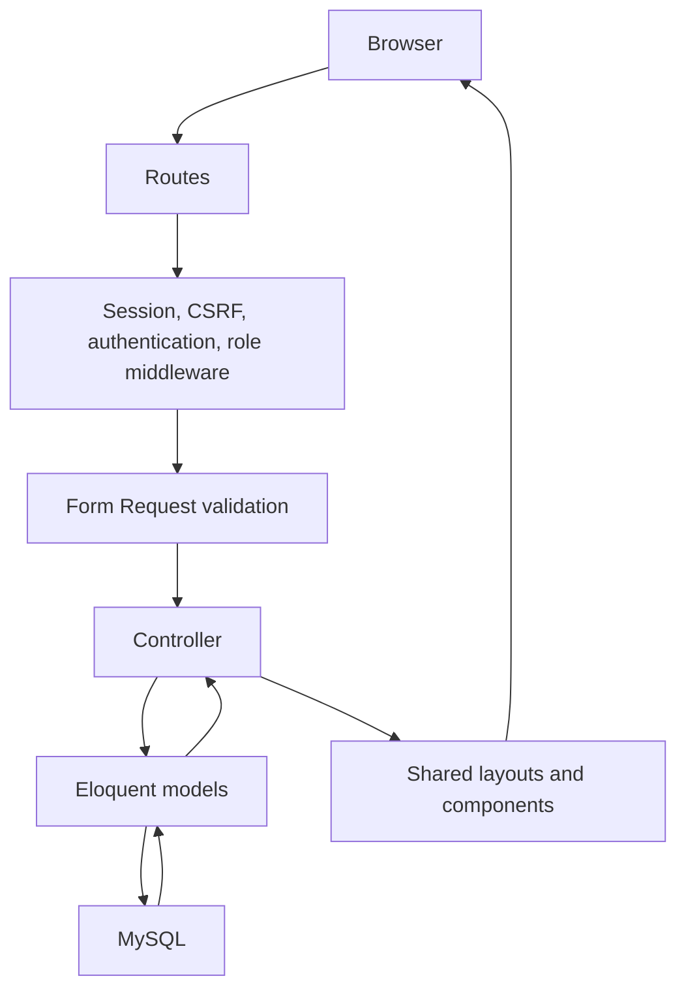

# Architecture

A single Laravel web application renders Blade pages. The browser submits normal HTML forms. MySQL stores persistent records. No separate API, SPA, or real-time service is needed.

Existing folders: `app/Models` stores record behavior; `app/Http/Requests` validates input; `app/Http/Controllers` coordinates requests; `app/Http/Middleware` gates roles; `app/Enums` defines allowed role values; `resources/views` renders pages; `database/migrations` versions schema; `tests/Feature` checks HTTP behavior.

Future booking policies will check ownership in addition to role. A future small booking workflow class may centralize transitions if that logic becomes complex. Role middleware alone cannot protect individual records.

Login uses Laravel's session guard. Registration excludes role from mass-assignment and assigns only a validated customer/provider enum. Sessions rotate after authentication and invalidate on logout. Routes in `web.php` receive Laravel's web middleware, including CSRF protection. Do not remove it.

No external service is required. Dependencies are installed and HTTP feature tests exercise this architecture using isolated SQLite. The provider foundation adds transactional registration/profile writes and Eloquent category discovery. See `09-provider-foundation.md`.
