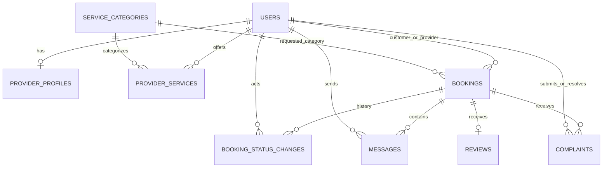

# Database design

Only the `users` migration is prepared. Every other table below is a planned schema; do not describe it as deployed.

| Table | Proposed important fields and constraints |
|---|---|
| users | id, name, unique email, hashed password, role, remember_token, timestamps |
| service_categories | id, unique name/slug, description, is_active, timestamps |
| provider_profiles | id, unique user_id FK, biography, experience_years, service_area, working_hours, is_available, timestamps |
| provider_services | id, provider_id FK to users, service_category_id FK, unique pair, timestamps |
| bookings | id, customer_id/provider_id/category_id FKs, problem_description, address, scheduled_at, status, timestamps |
| booking_status_changes | id, booking_id FK, actor_id FK, from_status, to_status, reason nullable, timestamps |
| messages | id, booking_id/sender_id FKs, body, timestamps |
| reviews | id, unique booking_id FK, rating 1–5, comment, is_hidden, timestamps |
| complaints | id, booking_id/submitter_id FKs, description, status, resolution_notes nullable, resolved_by nullable FK, timestamps |

Review customer/provider identities can be obtained through the booking instead of storing redundant identities. This prevents the review's provider differing from its booking's provider. Booking-linked complaints may be multiple per booking; duplicate/spam handling needs a rule before implementation.

## Relationships and integrity

User → provider profile is one-to-one; the unique user_id prevents two profiles for one user. User → customer bookings and User → provider bookings are separate has-many relationships using different foreign keys. Provider ↔ category is many-to-many through provider_services. Booking belongs to its customer, provider, and category; has many messages and status changes; has at most one review; has many complaints.

Foreign keys ensure records exist, but cannot prove a user has the appropriate role or that a provider offers a category. Application validation and policies must enforce those business rules. Review rating also needs server validation and an appropriate database constraint.

Plan indexes on `(provider_id,status,scheduled_at)`, `(customer_id,status)`, and message `(booking_id,created_at)`. Confirm actual query patterns before migration implementation. Use restricted deletion for historical bookings and deactivate referenced categories/accounts. Do not cascade away complaint or booking history.

Proposed lifecycle: Pending → Accepted → In Progress → Completed; Pending → Rejected; customer cancellation of Pending/Accepted before appointment. Post-acceptance provider cancellation and admin intervention rules remain unresolved. Do not implement undocumented shortcuts.
